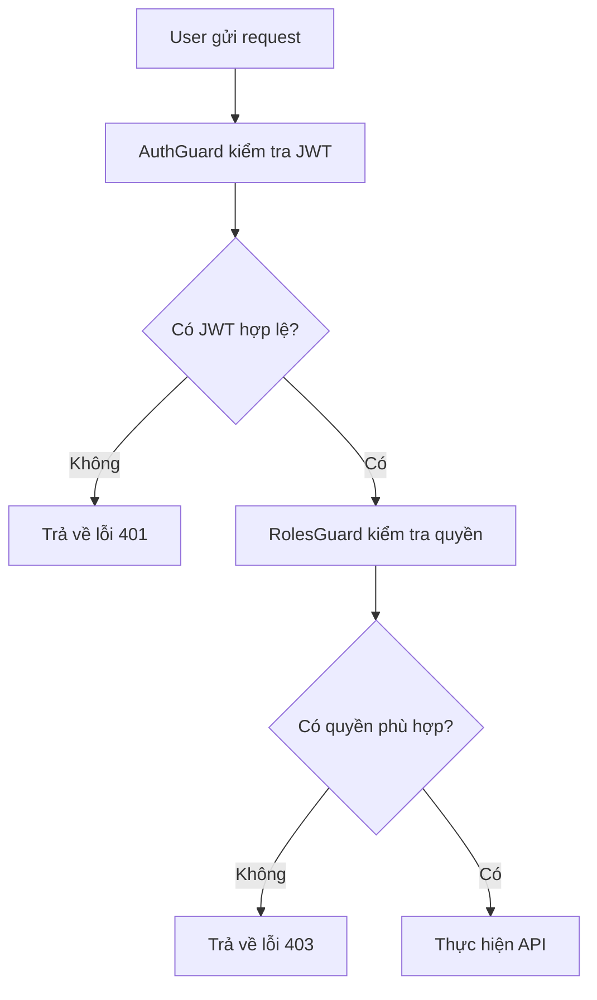
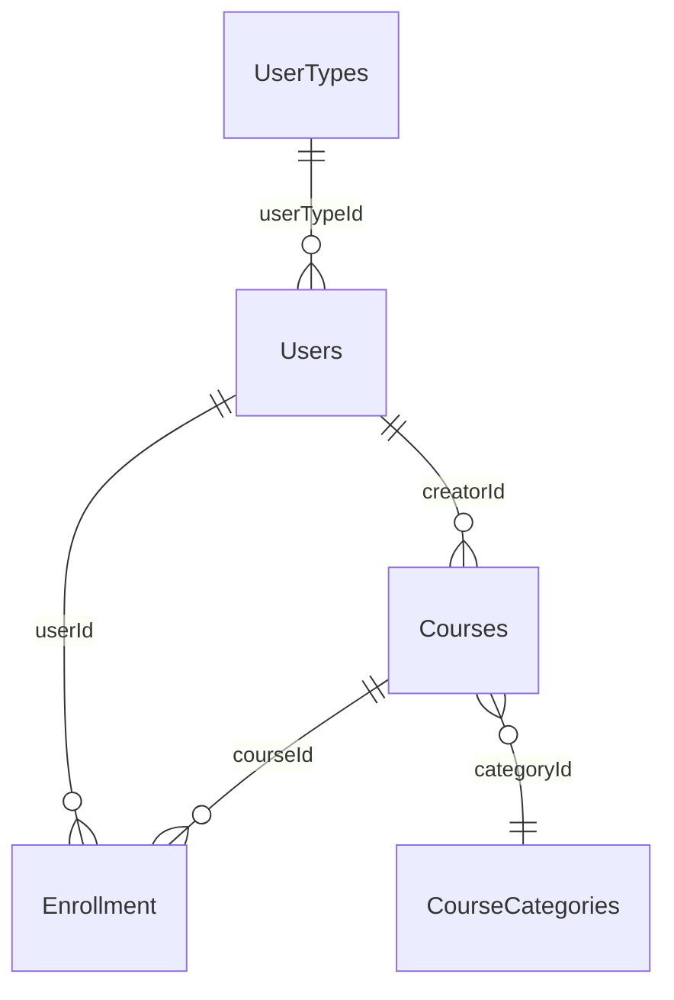

```mermaid
flowchart TD
  A[User gửi request] --> B[AuthGuard kiểm tra JWT]
  B --> C{Có JWT hợp lệ?}
  C -- Không --> D[Trả về lỗi 401]
  C -- Có --> E[RolesGuard kiểm tra quyền]
  E --> F{Có quyền phù hợp?}
  F -- Không --> G[Trả về lỗi 403]
  F -- Có --> H[Thực hiện API]
```

```mermaid
erDiagram
  UserTypes ||--o{ Users : "userTypeId"
  Users ||--o{ Enrollment : "userId"
  Users ||--o{ Courses : "creatorId"
  Courses ||--o{ Enrollment : "courseId"
  Courses }o--|| CourseCategories : "categoryId"
```
